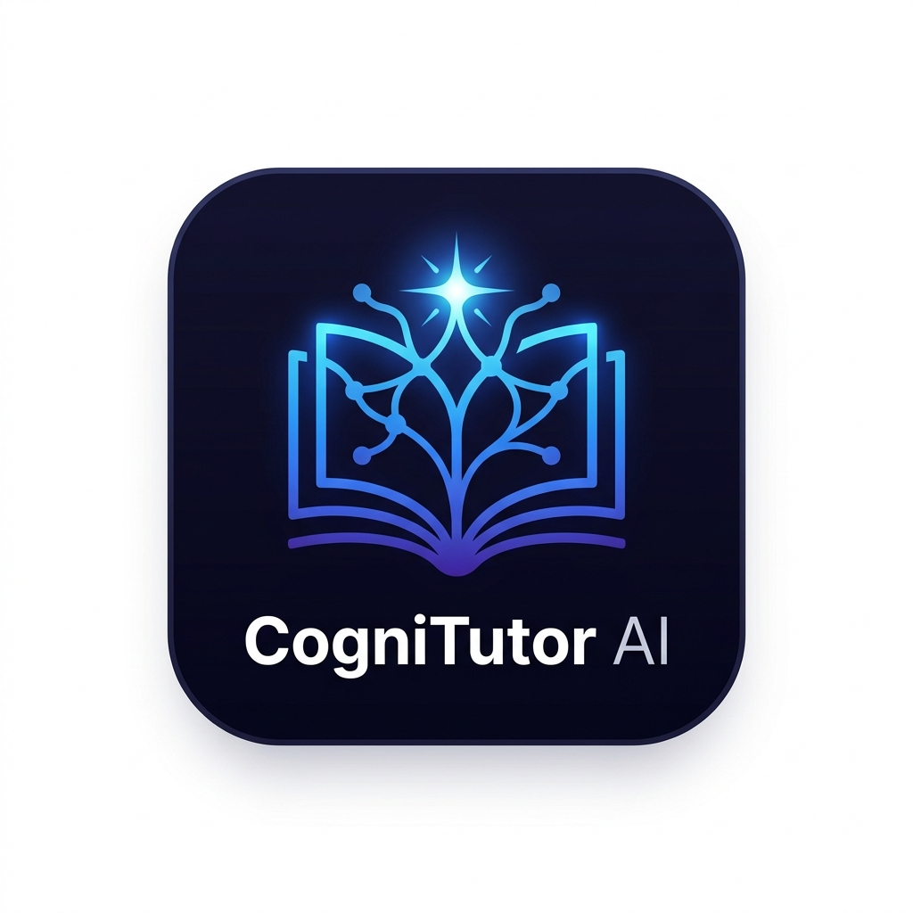
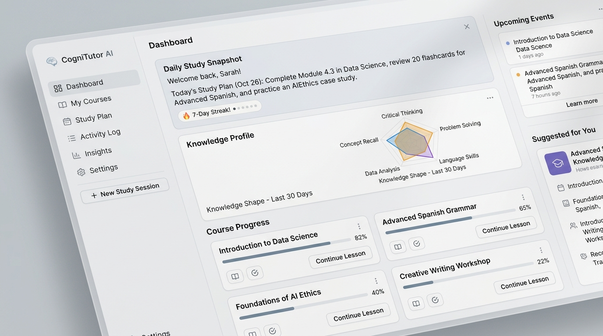
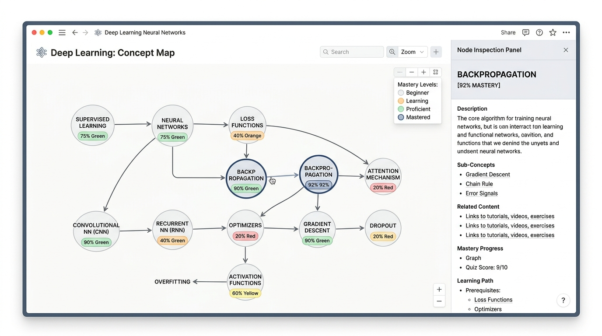
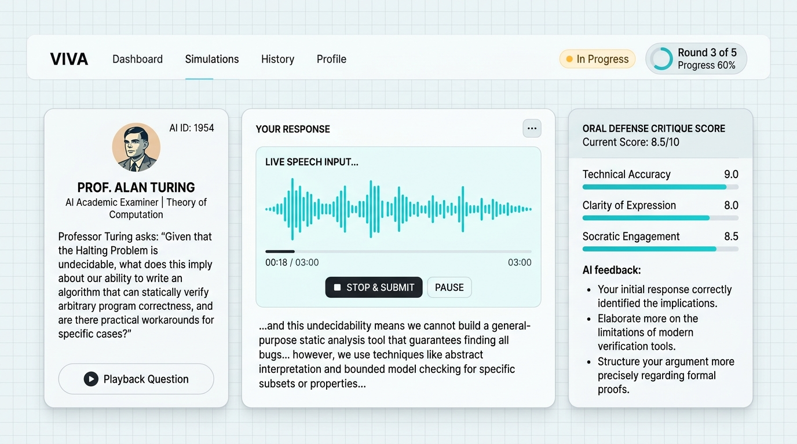
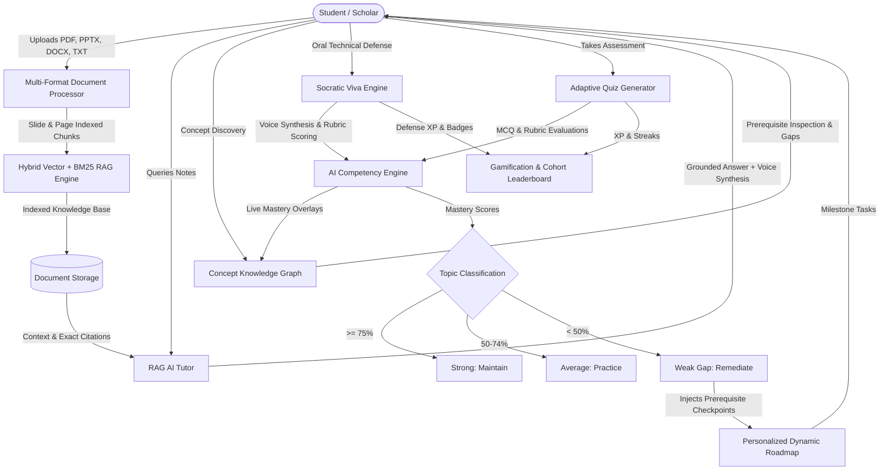

<p align="center">
  
</p>

<h1 align="center">CogniTutor AI</h1>

<p align="center">
  <strong>Your Personal AI Learning Copilot & Adaptive Socratic Tutor</strong><br>
  <em>Turn any PDF, PowerPoint (PPTX), Word Doc (DOCX), or Text file into an interactive personalized learning ecosystem.</em>
</p>

<p align="center">
  
  
  
  
  
  
  
</p>

---

## 🌟 Overview

**CogniTutor AI** is a production-grade personal tutoring platform designed to solve the passive learning trap. Instead of simply generating generic answers, CogniTutor reads your uploaded course notes, diagnoses what you know versus where your skill gaps lie, dynamically adapts test questions, presents visual prerequisite knowledge graphs, and conducts oral technical viva examinations with voice synthesis.

Built with an authentic **Notion / NotebookLM** human-crafted design system—free from sci-fi glowing purple neon tropes—focused entirely on clarity, deep conceptual retention, and academic rigor.

---

## 📸 Visual Showcase

### 1. Daily Study Snapshot & Knowledge Mastery Dashboard
*Track Bayesian topic mastery, review daily study snapshots, monitor 7-day study streaks, and inspect radar knowledge shape profiles.*
<p align="center">
  
</p>

---

### 2. Interactive Concept Knowledge Graph (Visual Ontology)
*Explore how Deep Learning concepts evolve, connect, and depend on each other. Nodes are dynamically color-coded with live competency scores (Emerald: Strong $\ge 75\%$, Amber: Average $50-74\%$, Rose: Weak Gap $< 50\%$).*
<p align="center">
  
</p>

---

### 3. Socratic Oral Viva Examination Mode
*Simulate a rigorous academic viva with **Prof. Turing (AI Examiner)**. Test conceptual understanding with live speech recognition, voice question playback, multi-round follow-up inquiries, and instant oral defense scorecards.*
<p align="center">
  
</p>

---

## ✨ Key Features

- **📚 Multi-Format Document Processing**: Upload PDFs, PowerPoint presentations (`.pptx`), Word documents (`.docx`), or Plain Text (`.txt`, `.md`). Chunks preserve exact page and slide numbers for citation footnote links.
- **🔍 Grounded Hybrid RAG AI Tutor**: TF-IDF vector space model paired with BM25 keyword matching guarantees responses are grounded strictly in your study material with academic citation pills.
- **💡 3-Level Progressive Doubt Solver**: Explains complex topics across three levels of abstraction:
  - *Beginner*: Intuitive real-world analogies.
  - *Intermediate*: Technical mathematics & theoretical intuitions.
  - *Advanced*: Production-ready PyTorch / Python code implementations.
- **🎯 Computerized Adaptive Testing (CAT)**: Quizzes dynamically scale difficulty (`Easy ↔ Medium ↔ Hard`) based on live student performance and streaks.
- **📊 Bayesian Competency & Skill Gap Engine**: Automatically categorizes curriculum mastery into *Strong*, *Average*, and *Weak Gaps*.
- **🗺️ Dynamic Personalized Roadmap**: Automatically schedules study milestones and injects prerequisite remediation before unlocking advanced lessons.
- **🕸️ Concept Knowledge Graph (Visual Ontology)**: Interactive visual DAG of concept prerequisites with live mastery status, relationship labels, and an interactive inspection drawer.
- **🎙️ Socratic Oral Viva Mode**: Hands-free voice interview simulator with misconception detection and university-grade oral scorecards.
- **🗣️ Voice AI Tutor**: Built-in Web Speech API speech synthesis and speech-to-text recording.
- **🏆 Gamification & Cohort Leaderboard**: Earn XP, level up, unlock 6 achievement badges, maintain streaks, and climb the cohort study leaderboard.

---

## 🏗️ System Architecture



---

## ⚡ Quickstart & Installation

### Prerequisites
- Python 3.11 or higher
- Modern Web Browser (Google Chrome, Edge, Safari, or Firefox)
- Git

### 1. Clone the Repository
```bash
git clone https://github.com/SyedZiyan/CogniTutor-AI-Learning-Platform.git
cd CogniTutor-AI-Learning-Platform
```

### 2. Create and Activate Virtual Environment
```bash
# Windows
python -m venv venv
venv\Scripts\activate

# macOS / Linux
python3 -m venv venv
source venv/bin/activate
```

### 3. Install Dependencies
```bash
pip install -r requirements.txt
```

### 4. Run the Application
```bash
python run.py
```
Open your browser and navigate to `http://127.0.0.1:8000`.

### 5. Run Verification Tests
```bash
python test_platform.py
```
*(All 12 automated unit and integration tests will execute and verify system health.)*

---

## 🔌 API Endpoints Reference

The backend provides **18 modular REST API endpoints**:

| Method | Endpoint | Description |
| :---: | :--- | :--- |
| `GET` | `/api/status` | System health, indexed files count, and chunk stats |
| `GET` | `/api/documents` | Pre-loaded and uploaded materials library |
| `GET` | `/api/documents/{doc_id}/chunks` | Inspect raw parsed chunks with page/slide metadata |
| `POST` | `/api/upload` | Upload new PDF, PPTX, DOCX, or TXT documents |
| `POST` | `/api/tutor/chat` | RAG Q&A grounded with exact citations |
| `POST` | `/api/tutor/doubt-solver` | 3-Level Progressive Doubt Explainer (Analogy, Math, Code) |
| `GET` | `/api/quiz/generate` | Adaptive multi-tier quiz generation |
| `POST` | `/api/quiz/evaluate-mcq` | MCQ scoring with adaptive difficulty adjustment & XP |
| `POST` | `/api/quiz/evaluate-short` | Short answer evaluation against key concept rubrics |
| `GET` | `/api/competency/analysis` | Topic mastery breakdown (Strong, Average, Weak) |
| `GET` | `/api/roadmap` | Dynamic study roadmap with remediation milestones |
| `POST` | `/api/roadmap/milestone/{id}/toggle` | Check off study milestones and earn XP |
| `GET` | `/api/gamification` | XP, student levels, badge showcase, leaderboard |
| `POST` | `/api/gamification/badge/{id}/unlock` | Achievement badge unlocker |
| `POST` | `/api/settings` | Update LLM provider (Local / OpenAI / Gemini / Ollama) |
| `GET` | `/api/graph` | Concept Knowledge Graph with live competency overlay |
| `POST` | `/api/viva/start` | Start Socratic oral viva session with Prof. Turing |
| `POST` | `/api/viva/respond` | Submit oral defense transcript for rubric evaluation |

---

## 📂 Project Structure

```
CogniTutor-AI-Learning-Platform/
├── backend/
│   ├── config.py              # Configuration & environment settings
│   ├── document_processor.py  # Multi-format document parser (PDF, PPTX, DOCX, TXT)
│   ├── storage.py             # Document store & chunk indexing
│   ├── rag_engine.py          # TF-IDF + BM25 hybrid retrieval engine
│   ├── tutor_engine.py        # RAG Q&A & 3-level doubt solver
│   ├── quiz_engine.py         # Adaptive quiz generator & rubric evaluators
│   ├── competency_engine.py   # Bayesian mastery & skill gap analysis
│   ├── roadmap_engine.py      # Dynamic roadmap with remediation checkpoints
│   ├── knowledge_graph.py     # Directed ontology graph & competency mapper
│   ├── viva_engine.py         # Socratic viva oral examination engine
│   ├── gamification.py        # XP, levels, badges, streaks, & leaderboard
│   ├── create_samples.py      # Preloaded course materials generator
│   └── main.py                # FastAPI application & route controllers
├── frontend/
│   ├── assets/                # Brand logo & SVG favicons
│   ├── css/
│   │   └── style.css          # Clean Notion/Linear light design system
│   ├── js/
│   │   ├── api.js             # Client API SDK
│   │   ├── charts.js          # Chart.js radar & progress visualizers
│   │   ├── voice.js           # Web Speech API speech synthesis & recognition
│   │   └── app.js             # Main SPA application controller
│   └── index.html             # Single Page Application
├── docs/
│   └── images/                # Visual previews, screenshots, & brand marks
├── sample_materials/          # Preloaded course documents (.pdf, .pptx, .docx, .txt)
├── requirements.txt           # Python dependencies
├── run.py                     # Application launcher
└── test_platform.py           # Automated test suite (12 test suites)
```

---

## 🔒 Privacy & Local Execution
- **Zero Required External Keys**: Runs 100% locally with built-in TF-IDF vector retrieval and heuristic synthesis.
- **Optional Cloud / Local LLMs**: Easily plug in OpenAI GPT-4o, Google Gemini 2.0, or Ollama via the Settings drawer.

---

## 📄 License
This project is open-source under the **MIT License**.

---

<p align="center">
  Crafted with care by <a href="https://github.com/SyedZiyan">Syed Ziyan</a>
</p>
